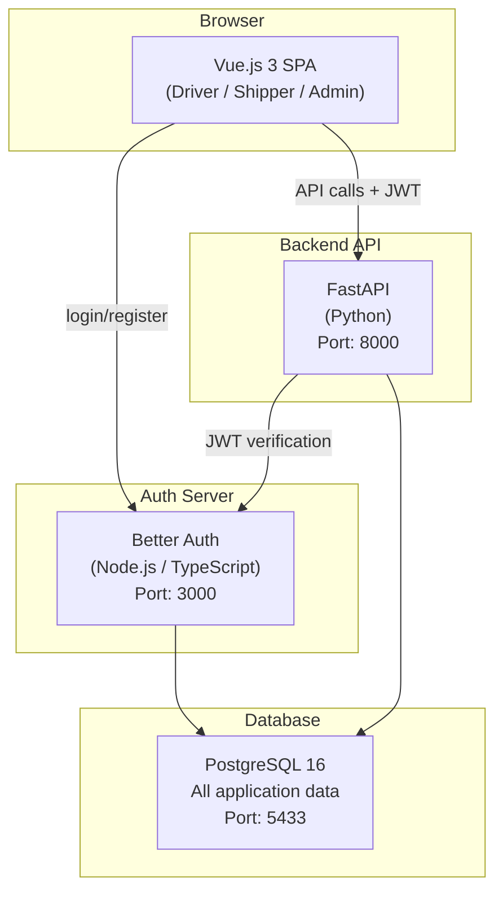

# RoadLancer — Tech Stack

## Architecture Overview

> **Note:** Three-service architecture. Better Auth handles authentication, FastAPI handles business logic, Vue.js is the frontend. All run locally — no Docker.

---

## Backend (FastAPI)

| Component | Technology | Purpose |
|-----------|-----------|---------|
| **Framework** | FastAPI (Python 3.12+) | REST API for shipments, bids, verifications |
| **ORM** | Prisma (`prisma-client-py`) | Database schema, migrations, queries |
| **Auth** | `fastapi-betterauth` | JWT verification from Better Auth server |
| **AI Pricing** | scikit-learn, numpy | Price estimation (bundled in same service) |
| **Validation** | Pydantic v2 | Request/response schemas |
| **Server** | Uvicorn | ASGI development server |

---

## Auth Server (Better Auth)

| Component | Technology | Purpose |
|-----------|-----------|---------|
| **Runtime** | Node.js 20+ | Better Auth server |
| **Auth Library** | Better Auth | Registration, login, sessions, JWT |
| **Database** | Prisma (via `@better-auth/prisma-adapter`) | Auth tables (user, session, account) |
| **JWT** | Better Auth JWT plugin | Token generation for FastAPI |

### Better Auth Tables (managed by auth-server)

| Table | Purpose |
|-------|---------|
| `user` | User accounts (id, name, email, password, role, phone) |
| `session` | Active sessions |
| `account` | OAuth providers (future use) |
| `verification` | Email verification tokens |

---

## Frontend (Vue.js)

| Component | Technology | Purpose |
|-----------|-----------|---------|
| **Framework** | Vue.js 3 (Composition API) | Interactive UI |
| **Build Tool** | Vite | Bundling, HMR |
| **Styling** | Tailwind CSS 4 | Utility-first CSS |
| **HTTP Client** | Axios | API calls to FastAPI |
| **Auth Client** | `@better-auth/vue` | Login, register, session |
| **Charts** | Chart.js + vue-chartjs | Dashboard analytics |

---

## Database

| Component | Technology | Purpose |
|-----------|-----------|---------|
| **Database** | PostgreSQL 16 | All application data |
| **Schema Manager** | Prisma | Migrations, type-safe queries |
| **Port** | 5433 | Local PostgreSQL instance |
| **Database Name** | roadlancer | Single DB shared by auth + backend |

### Schema Ownership

| Tables | Managed By |
|--------|-----------|
| `user`, `session`, `account`, `verification` | Better Auth (auth-server) |
| `shipments`, `bids`, `verifications` | FastAPI (backend) via Prisma |

---

## Development Tools

| Tool | Purpose |
|------|---------|
| **Python 3.12+** | FastAPI runtime |
| **uv** | Python dependency management |
| **Node.js 20+** | Better Auth runtime |
| **npm** | Node.js dependency management |
| **PostgreSQL 16** | Database (local, port 5433) |
| **DataGrip / pgAdmin** | Database GUI for inspection |

---

## Why This Stack? (College Project Rationale)

| Choice | Reason |
|--------|--------|
| **FastAPI** | Modern Python framework, auto-generated API docs, async support, great for learning |
| **Prisma** | Type-safe ORM, excellent migration system, works with both Node.js and Python |
| **Better Auth** | Production-ready auth with JWT, session management, role-based access |
| **Vue.js** | Gentle learning curve, reactive components, pairs well with any backend |
| **Tailwind CSS** | Rapid UI development without custom CSS files |
| **No Docker** | Runs directly on laptop, no containerization overhead |
| **No Redis** | Unnecessary complexity for college demo |
| **No WebSockets** | Simple AJAX polling is enough for bidding updates at demo scale |
