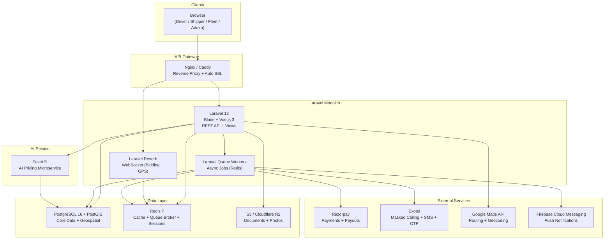

# RoadLancer — Tech Stack

## Architecture Overview



---

## Backend

| Component | Technology | Purpose |
|-----------|-----------|---------|
| **Framework** | Laravel 12 (PHP 8.2+) | Full-stack monolith with Blade templates, Eloquent ORM, built-in auth |
| **ORM** | Eloquent | Database abstraction with migrations, relationships, and query builder |
| **Templates** | Blade | Server-rendered views with `@vite` directive for Vue.js integration |
| **Auth** | Laravel native sessions | Email/password auth with bcrypt hashing, database session storage |
| **Queue** | Laravel Queue (Redis driver) | Async job processing: bid expiry, payment webhooks, OTP dispatch |
| **Scheduler** | Laravel Task Scheduling | Cron-based recurring tasks via `php artisan schedule:run` |
| **WebSockets** | Laravel Reverb | Real-time bidding updates + GPS location streaming |
| **File Storage** | Laravel Filesystem (S3 driver) | Document uploads, verification photos, driver license scans |
| **API** | Laravel API routes | RESTful JSON endpoints consumed by Vue.js components and mobile apps |

### Why Laravel over Django?

- **Monolith-first architecture** — Blade + Vue.js eliminates the complexity of a separate frontend deployment
- **Built-in batteries** — Auth, queues, scheduling, broadcasting, file storage, and mail all ship natively
- **Eloquent ORM** — Expressive ActiveRecord pattern with eager loading and relationship management
- **Artisan CLI** — Code generation, migrations, and dev tooling out of the box
- **Ecosystem maturity** — Laravel Forge, Vapor (serverless), Reverb (WebSockets) for production readiness

---

## Frontend

| Component | Technology | Purpose |
|-----------|-----------|---------|
| **Framework** | Vue.js 3 (Composition API) | Reactive UI components embedded in Blade templates via Vite |
| **Build Tool** | Vite | Lightning-fast HMR, CSS/JS bundling, integrated with Laravel via `@vite` |
| **Styling** | Tailwind CSS 4 | Utility-first CSS for rapid, responsive UI development |
| **State** | Pinia | Lightweight reactive stores for bid state, user session, tracking |
| **HTTP Client** | Axios | API calls to Laravel backend and AI microservice |
| **Forms** | VeeValidate + Zod | Schema-based form validation with Vue composables |
| **Maps** | vue3-google-map | Shipment route display, driver GPS tracking on live map |
| **Charts** | Chart.js + vue-chartjs | Admin analytics, shipper price history, driver earnings dashboards |
| **i18n** | vue-i18n | Hindi + English localization at launch |

### Vue.js Integration Pattern

Vue components are embedded in Blade templates using Laravel's Vite integration:

```blade
{{-- resources/views/layouts/app.blade.php --}}
<!DOCTYPE html>
<html>
<head>
    @vite(['resources/css/app.css', 'resources/js/app.js'])
</head>
<body>
    <div id="app">
        @yield('content')
    </div>
</body>
</html>
```

```javascript
// resources/js/app.js
import { createApp } from 'vue'
import BiddingPanel from './components/BiddingPanel.vue'

const app = createApp({})
app.component('bidding-panel', BiddingPanel)
app.mount('#app')
```

---

## AI & Pricing Microservice

| Component | Technology | Purpose |
|-----------|-----------|---------|
| **Framework** | FastAPI 0.110+ | High-performance async Python API for ML inference |
| **ML Engine** | scikit-learn / XGBoost | Price floor calculation and demand prediction models |
| **Geospatial** | NumPy + SciPy | Backhaul matching via haversine distance calculations |
| **Validation** | Pydantic v2 | Request/response schema validation with automatic OpenAPI docs |
| **Server** | Uvicorn | ASGI server for production deployment |

### Endpoints

| Method | Path | Purpose |
|--------|------|---------|
| `GET` | `/` | Health check |
| `POST` | `/price-estimate` | Calculate AI price floor + market rate range |
| `POST` | `/backhaul-suggest` | Ranked nearby return loads for deadhead reduction |

---

## Infrastructure

| Component | Technology | Purpose |
|-----------|-----------|---------|
| **Database** | PostgreSQL 16 + PostGIS | Relational data + geospatial corridor queries |
| **Cache & Broker** | Redis 7 Alpine | Session storage, cache, queue broker, WebSocket pub/sub |
| **Object Storage** | Cloudflare R2 / AWS S3 | Driver documents, verification photos, invoices |
| **Containerization** | Docker + Docker Compose | Local dev environment and production deployment |
| **Reverse Proxy** | Nginx / Caddy | SSL termination, static asset serving, load balancing |

---

## External Service Integrations

| Service | Provider | Purpose |
|---------|----------|---------|
| **Payments** | Razorpay | Escrow payment holds, split payouts, business subscriptions |
| **Communication** | Exotel | SMS OTP dispatch, ExoPhone masked calling (prevents disintermediation) |
| **Maps & Routing** | Google Maps Platform | Distance matrix, geocoding, route optimization, live tracking |
| **Push Notifications** | Firebase Cloud Messaging | Real-time alerts for bid updates, shipment status, driver assignments |

---

## Security

| Measure | Implementation |
|---------|---------------|
| **Authentication** | Laravel session auth with bcrypt password hashing |
| **CSRF Protection** | Laravel built-in CSRF tokens on all forms |
| **SQL Injection** | Eloquent parameterized queries |
| **XSS Prevention** | Blade auto-escaping `{{ }}` syntax |
| **Rate Limiting** | Laravel `ThrottleRequests` middleware |
| **CORS** | `config/cors.php` for API endpoint access control |
| **Encryption** | `APP_KEY` based encryption for sensitive data at rest |
