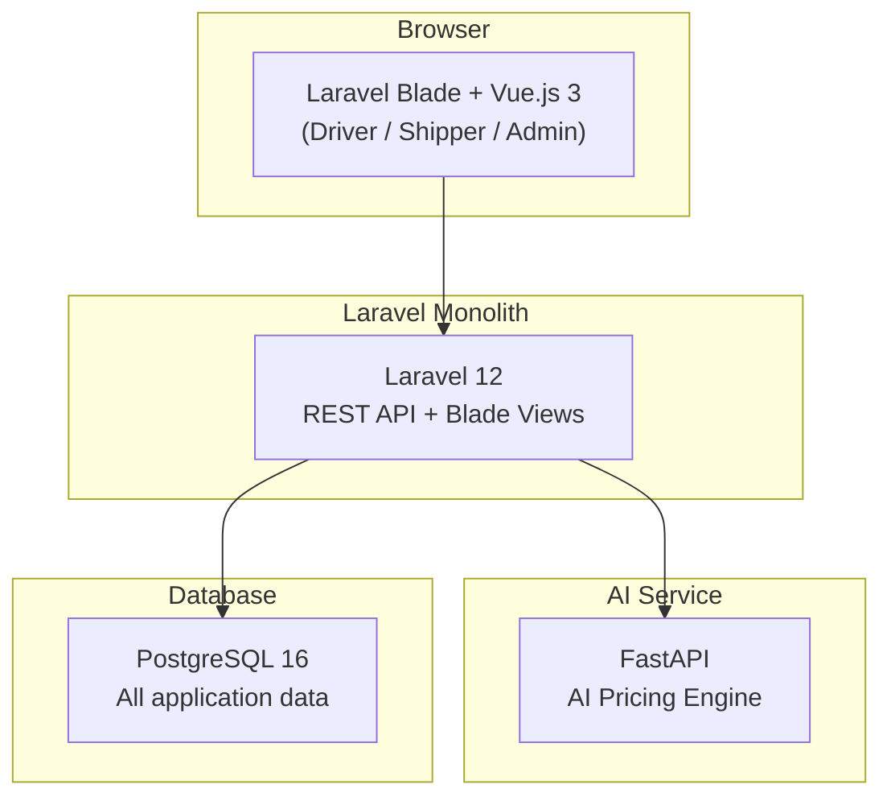

# RoadLancer — Tech Stack

## Architecture Overview

> **Note:** This is a simplified college-project architecture. No Redis, no Docker, no WebSockets, no external API integrations. Everything runs locally with `php artisan serve` and `npm run dev`.

---

## Backend

| Component | Technology | Purpose |
|-----------|-----------|---------|
| **Framework** | Laravel 12 (PHP 8.2+) | Full-stack monolith with Blade views and REST API |
| **ORM** | Eloquent | Database queries, migrations, model relationships |
| **Templates** | Blade | Server-rendered HTML pages |
| **Auth** | Laravel native sessions | Email/password login with bcrypt hashing |
| **Database** | PostgreSQL 16 | All application data (users, shipments, bids) |
| **Cache** | File driver | Simple file-based caching (no Redis needed) |
| **Queue** | Sync driver | Jobs run synchronously (no Redis/worker needed) |
| **Sessions** | Database driver | Session data stored in PostgreSQL |

---

## Frontend

| Component | Technology | Purpose |
|-----------|-----------|---------|
| **Views** | Blade templates | Server-rendered pages (layouts, auth, dashboards) |
| **Components** | Vue.js 3 (Composition API) | Interactive UI components (bidding panel, forms, charts) |
| **Build Tool** | Vite | CSS/JS bundling with hot module replacement |
| **Styling** | Tailwind CSS 4 | Utility-first responsive CSS |
| **HTTP Client** | Axios | API calls from Vue components to Laravel backend |
| **Charts** | Chart.js + vue-chartjs | Dashboard analytics and earnings visualizations |

---

## AI Microservice

| Component | Technology | Purpose |
|-----------|-----------|---------|
| **Framework** | FastAPI | Lightweight Python API for AI price calculations |
| **Validation** | Pydantic v2 | Request/response schema validation |
| **Server** | Uvicorn | ASGI development server |

### Endpoints

| Method | Path | Purpose |
|--------|------|---------|
| `GET` | `/` | Health check |
| `POST` | `/price-estimate` | Calculate AI price floor + fair market range |
| `POST` | `/backhaul-suggest` | Suggest nearby return loads (mocked data) |

---

## Development Tools

| Tool | Purpose |
|------|---------|
| **PHP 8.2+** | Laravel runtime |
| **Composer** | PHP dependency management |
| **Node.js 20+** | Vite build tool and npm packages |
| **Python 3.11+** | FastAPI AI microservice runtime |
| **uv** | Python dependency management |
| **PostgreSQL 16** | Database (install locally) |
| **DataGrip / pgAdmin** | Database GUI for inspection |

---

## Why This Stack? (College Project Rationale)

| Choice | Reason |
|--------|--------|
| **Laravel** | Most popular PHP framework, excellent documentation, batteries-included (auth, ORM, validation, mail). Widely taught in universities. |
| **Vue.js** | Gentle learning curve, pairs naturally with Laravel via Vite, reactive components without React complexity. |
| **PostgreSQL** | Industry-standard relational database, free, supports complex queries. |
| **FastAPI** | Simple Python microservice for demonstrating AI/ML integration. Auto-generates API docs at `/docs`. |
| **Tailwind CSS** | Rapid UI development without writing custom CSS files. |
| **No Redis** | Unnecessary complexity for a college demo. File cache and sync queue are sufficient. |
| **No Docker** | Runs directly on laptop with `php artisan serve`. No containerization overhead. |
| **No WebSockets** | Simple page refresh or AJAX polling is enough for bidding updates at demo scale. |
