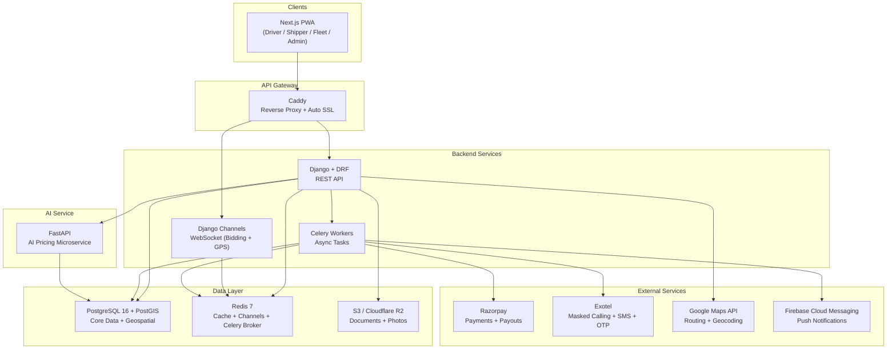

# RoadLancer — Tech Stack

## Architecture Overview



---

## Frontend

| Component | Technology | Purpose |
|-----------|-----------|---------|
| **Framework** | Next.js 15 (App Router) | React-based SSR/SSG framework, deployed as a PWA |
| **Language** | TypeScript | Type safety across the frontend codebase |
| **Styling** | Tailwind CSS 4 | Utility-first CSS for rapid, responsive UI development |
| **UI Components** | shadcn/ui + Radix UI | Accessible, customizable component library — no vendor lock-in |
| **State Management** | Zustand | Lightweight store for bid state, user session, active shipment tracking |
| **Data Fetching** | TanStack Query (React Query) | Server state caching, background refetching, optimistic updates |
| **Real-time** | Native WebSocket API (custom hook) | Live bidding updates + GPS location streaming via Django Channels |
| **Forms** | React Hook Form + Zod | Performant form handling with schema-based validation |
| **i18n** | next-intl | Route-based internationalization — Hindi + English at launch |
| **Maps** | @react-google-maps/api | Shipment route display, driver GPS tracking on live map |
| **Charts** | Recharts | Admin analytics, shipper price history, driver earnings dashboards |
| **Onboarding** | react-joyride | Interactive step-by-step walkthrough for first-time driver onboarding |

### PWA Capabilities

- 📱 **Installable** — Add to Home Screen, launches fullscreen
- 🔔 **Push Notifications** — Browser Push API via service worker
- 📍 **Geolocation** — GPS tracking for drivers in transit
- 📷 **Camera Access** — Photo proof at pickup and delivery
- 📴 **Offline Caching** — View active shipments without internet
- ⚡ **No App Store** — Instant updates, no review process

---

## Backend API

| Component | Technology | Purpose |
|-----------|-----------|---------|
| **Framework** | Django 5.x | Batteries-included Python framework (ORM, admin, auth, migrations) |
| **API Layer** | Django REST Framework (DRF) | Serializers, viewsets, permissions, throttling, pagination |
| **Authentication** | Custom OTP module + `django-phonenumber-field` | Phone + OTP primary auth, optional email/password for companies |
| **i18n** | Django built-in i18n + `django-modeltranslation` | Server-side internationalization for dynamic content |
| **Task Queue** | Celery 5.x | Async processing: payment callbacks, SMS, AI inference, notifications |
| **Scheduler** | Celery Beat | Periodic tasks: bid window expiry, payment release, AI retraining |
| **WebSocket** | Django Channels 4.x | Real-time bidding updates, GPS location streaming |
| **Channel Layer** | `channels_redis` | Redis pub/sub for WebSocket message routing |

### Key Django Apps (Planned)

```
apps/
├── accounts/        # User models, OTP auth, role management, verification
├── shipments/       # Shipment CRUD, lifecycle states, filtering
├── bidding/         # Bid placement, bid windows, winner selection
├── payments/        # Razorpay integration, split payments, payouts, subscriptions
├── tracking/        # GPS data ingestion, location history, live tracking
├── ratings/         # Multi-dimensional ratings, badges, threshold enforcement
├── chat/            # In-app messaging between driver and shipper
├── notifications/   # Push (FCM), SMS (Exotel), in-app notification management
├── fleet/           # Fleet manager dashboard, vehicle/driver assignment
├── disputes/        # Dispute tickets, automated resolution, escalation
├── admin_panel/     # Custom admin views (extends Django admin)
└── core/            # Shared utilities, permissions, middleware
```

---

## AI / ML Microservice

| Component | Technology | Purpose |
|-----------|-----------|---------|
| **Framework** | FastAPI | Async Python API for serving ML models — fast, auto-documented |
| **Price Estimation** | scikit-learn → XGBoost/LightGBM | Regression model for price prediction based on route, weight, goods, season |
| **Backhaul Matching** | scikit-learn NearestNeighbors + custom scoring | Recommend nearby shipments from driver's drop-off location |
| **Model Serialization** | joblib | Save/load trained models, version management |
| **Retraining** | Celery Beat (triggered) | Periodic model retraining as transaction data accumulates |

### AI API Endpoints

```
POST /api/ai/price-estimate     → Input: route, weight, goods type → Output: estimated range + min floor
POST /api/ai/backhaul-suggest   → Input: driver location, vehicle type → Output: ranked nearby shipments
POST /api/ai/retrain            → Trigger: Celery Beat periodic task → Retrains model on latest data
```

### Cold-Start Strategy

1. Seed with government transport rate charts, fuel price data, distance matrices
2. Manual research on 50–100 common routes for initial pricing baselines
3. Continuously learn from real platform bidding and transaction data
4. AI floor improves in accuracy over time as data volume grows

---

## Database

| Component | Technology | Purpose |
|-----------|-----------|---------|
| **Primary DB** | PostgreSQL 16 | ACID-compliant relational data: users, shipments, bids, payments, subscriptions |
| **Geospatial** | PostGIS (PostgreSQL extension) | Efficient geo queries: "find shipments within 50km", distance calculations, route bounding |
| **Cache + Broker** | Redis 7 | Celery task broker, Django Channels layer, API response caching, bid countdown timers, session storage |

### Why PostgreSQL + PostGIS (not MongoDB)

- Single database handles **both** relational data (users, payments) **and** geospatial queries (location-based shipment search)
- ACID compliance is critical for financial transactions (payment processing, commission deduction)
- Django ORM has first-class PostgreSQL support
- PostGIS is the industry standard for geospatial — powers Uber, OpenStreetMap, and most mapping platforms

### Why No Elasticsearch for MVP

- PostgreSQL full-text search handles shipment filtering at MVP scale
- PostGIS handles all geospatial queries natively
- Add Elasticsearch in Phase 3 if search complexity warrants it

---

## File Storage

| Component | Technology | Purpose |
|-----------|-----------|---------|
| **Object Storage** | AWS S3 or Cloudflare R2 | Driver documents (license, RC, Aadhaar), delivery photos, profile pictures |
| **Django Integration** | `django-storages` | Seamless S3-compatible backend for Django file handling |
| **Image Processing** | Pillow + `django-imagekit` | Resize and compress uploaded photos to save storage and bandwidth |

---

## External Services

### Payments — Razorpay

| Feature | Razorpay Product |
|---------|-----------------|
| Accept UPI, cards, netbanking, wallets | Payment Gateway |
| Split payments (2% platform, rest to driver) | Razorpay Route |
| Business shipper monthly billing (₹1K/month) | Razorpay Subscriptions |
| Driver bank account payouts | Razorpay Payouts (via Route) |
| Payment event callbacks | Razorpay Webhooks → Django endpoint |

### Communication — Exotel

| Feature | Exotel Product |
|---------|---------------|
| OTP delivery for authentication | SMS API |
| Masked phone calls (driver ↔ shipper) | ExoPhone (virtual numbers) |
| SMS notifications (bid won, payment, alerts) | SMS API |
| DLT compliance (mandatory in India) | Built-in |

**Why Exotel over Twilio:**
- India-focused, built-in DLT compliance (mandatory for Indian SMS)
- ExoPhone provides native number masking — critical for platform privacy
- Lower SMS cost: ~₹0.15–0.20/SMS vs Twilio's ₹0.50+
- Better local carrier integration and delivery rates

### Push Notifications — Firebase Cloud Messaging (FCM)

| Feature | Details |
|---------|---------|
| PWA push notifications | Via service worker + FCM Web SDK |
| Notification types | Bid won, shipment updates, payment received, new shipments nearby |
| Fallback | SMS via Exotel when user is offline or has notifications disabled |

### Maps & Geocoding — Google Maps Platform

| Feature | API |
|---------|-----|
| Route distance and ETA calculation | Directions API |
| Address → coordinates conversion | Geocoding API |
| Address autocomplete in forms | Places API |
| Live tracking map display | Maps JavaScript API |
| Distance matrix for AI pricing | Distance Matrix API |

> **Cost note:** Google Maps provides $200/month free credit (~28,000 direction requests). If usage exceeds this, consider Mapbox or self-hosted OSRM (OpenStreetMap) for routing.

---

## DevOps & Infrastructure

| Component | Technology | Purpose |
|-----------|-----------|---------|
| **Containerization** | Docker + Docker Compose | Consistent dev/prod environments, package all services together |
| **CI/CD** | GitHub Actions | Automated testing, linting, deployment on every push |
| **Hosting (MVP)** | Railway or Render | Simple PaaS — managed Postgres, Redis, easy Django/Next.js deployment |
| **Hosting (Scale)** | AWS Mumbai (ap-south-1) | EC2 + RDS + ElastiCache + S3 when traffic demands it |
| **Reverse Proxy** | Caddy | Automatic HTTPS, WebSocket proxying, static file serving |
| **Error Monitoring** | Sentry | Catches Python and JavaScript errors in production, alerting |
| **Uptime Monitoring** | Uptime Robot | Alerts on downtime — free tier covers MVP needs |
| **Logging** | Django built-in logging → stdout | Railway/Render captures stdout logs. Add ELK or Datadog at scale. |

---

## Development Tools

| Tool | Version / Choice | Purpose |
|------|-----------------|---------|
| **Python** | 3.12+ | Backend runtime |
| **Node.js** | 20 LTS | Frontend runtime |
| **Python Package Manager** | uv | Fast, modern dependency management (replaces pip + virtualenv) |
| **JS Package Manager** | pnpm | Fast, disk-efficient package management |
| **Python Formatting** | Ruff | Extremely fast linting + formatting (replaces Black + Flake8 + isort) |
| **JS Formatting** | Prettier | Consistent code formatting |
| **Python Linting** | Ruff | Combined linter covering all major rule sets |
| **JS Linting** | ESLint | TypeScript + React linting rules |
| **Python Type Checking** | mypy | Static type analysis for Python |
| **Backend Testing** | pytest + pytest-django | Unit and integration testing for Django |
| **Frontend Testing** | Vitest | Fast unit testing for React components |
| **API Testing** | httpx (code) + Thunder Client (manual) | API endpoint testing during development |
| **Git Hooks** | pre-commit (Python) + husky (JS) | Auto-run linters and formatters before commits |
| **Version Control** | Git + GitHub | Source control + PR reviews + issue tracking |

---

## Complete Stack at a Glance

```
┌─────────────────────────────────────────────────────┐
│                    FRONTEND                         │
│  Next.js 15 (PWA) · TypeScript · Tailwind CSS 4    │
│  shadcn/ui · Zustand · TanStack Query · next-intl  │
│  react-joyride · Recharts · React Hook Form + Zod  │
├─────────────────────────────────────────────────────┤
│                  REAL-TIME LAYER                    │
│       WebSocket (Django Channels + Redis)           │
│            PWA Push + FCM + Exotel SMS              │
├─────────────────────────────────────────────────────┤
│                    BACKEND                          │
│    Django 5 + DRF         │  FastAPI (AI service)   │
│    Celery + Celery Beat   │  scikit-learn / XGBoost │
├─────────────────────────────────────────────────────┤
│                   DATA LAYER                        │
│  PostgreSQL 16    │  Redis 7      │  S3 / R2        │
│  + PostGIS        │  (cache +     │  (documents +   │
│  (geospatial)     │   broker)     │   photos)       │
├─────────────────────────────────────────────────────┤
│               EXTERNAL SERVICES                     │
│  Razorpay     │  Exotel      │  Google Maps │  FCM  │
│  (payments)   │  (SMS +      │  (routing +  │(push) │
│               │   masking)   │   geocoding) │       │
├─────────────────────────────────────────────────────┤
│                    DEVOPS                            │
│  Docker · GitHub Actions · Railway/Render (MVP)     │
│  Sentry (errors) · Caddy (proxy) · Uptime Robot    │
└─────────────────────────────────────────────────────┘
```

---

## Project Structure (Planned)

```
RoadLancer/
├── backend/                    # Django project
│   ├── config/                 # Django settings, URLs, ASGI/WSGI
│   ├── apps/                   # Django apps (accounts, shipments, bidding, etc.)
│   ├── requirements/           # pip requirements (base, dev, prod)
│   ├── manage.py
│   └── Dockerfile
├── frontend/                   # Next.js project
│   ├── src/
│   │   ├── app/                # App Router pages (role-based routing)
│   │   │   ├── (auth)/         # Login, signup, OTP verification
│   │   │   ├── driver/         # Driver dashboard, bid, tracking
│   │   │   ├── shipper/        # Shipper dashboard, post shipment
│   │   │   ├── fleet/          # Fleet manager dashboard
│   │   │   └── admin/          # Admin panel
│   │   ├── components/         # Shared UI components
│   │   ├── hooks/              # Custom hooks (useWebSocket, useGeolocation)
│   │   ├── lib/                # API client, utilities, constants
│   │   ├── stores/             # Zustand stores
│   │   └── i18n/               # Translation files (hi, en)
│   ├── public/                 # Static assets, PWA manifest, icons
│   └── Dockerfile
├── ai-service/                 # FastAPI microservice
│   ├── app/
│   │   ├── models/             # ML model definitions and training
│   │   ├── routers/            # API endpoints
│   │   └── data/               # Seed data, model artifacts
│   └── Dockerfile
├── docker-compose.yml          # Local development orchestration
├── .github/workflows/          # CI/CD pipelines
├── project-scope.md
└── tech-stack.md
```
